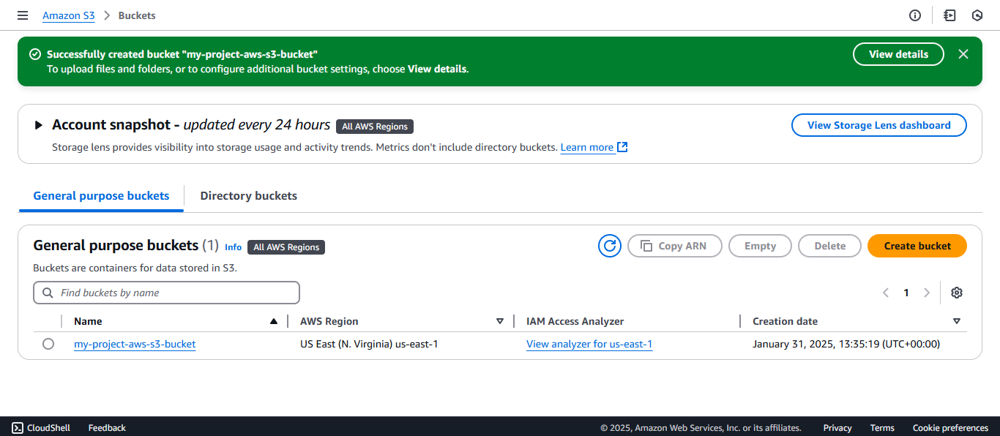
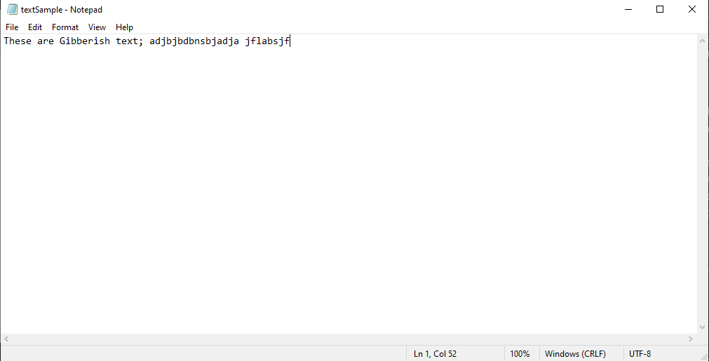
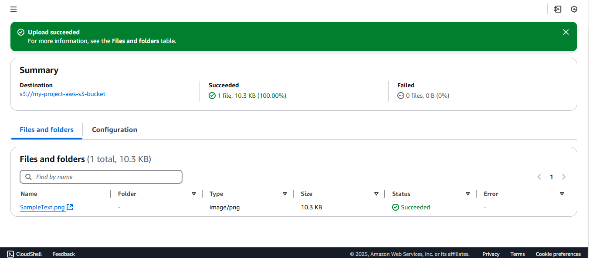
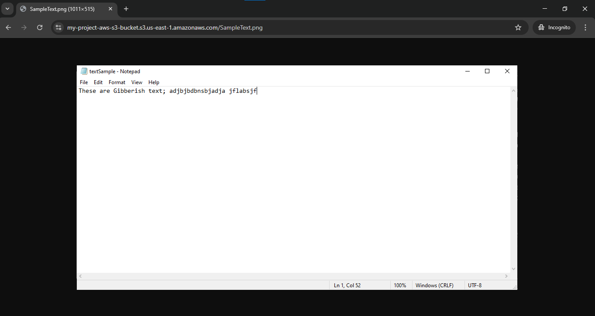

# Introduction to Amazon S3

## Overview

Amazon Simple Storage Service (**Amazon S3**) is a highly scalable and secure object storage service that enables DevOps engineers to efficiently store, retrieve, and manage data for applications, backups, and workflows from anywhere.

This guide provides step-by-step instructions on creating an S3 bucket, uploading objects, setting permissions, and testing access.

---

## Objectives

1. **Create an Amazon S3 Bucket**
2. **Upload an Object to the Bucket**
3. **Set Object Permissions**
4. **Test Object Access**

## 1. Creating an Amazon S3 Bucket

1. Navigate to the **S3 Management Console** on AWS.
2. Click **Create Bucket**.
3. Provide a unique **Bucket Name** (must be unique across all AWS users).
4. Select a **Region** close to your application or users.
5. Click **Create**.
6. Your newly created bucket will now appear in the bucket list.



## 2. Uploading an Object to the Bucket

1. Open the S3 bucket you just created.
2. Click **Upload** and select a file (e.g., `textSample.txt`).



---

3. Click **Upload** to complete the process.
4. Once uploaded, the object will be listed in the bucket.



---

## 3. Setting Object Permissions

### Enable Public Access for the Bucket

1. Open your bucket in the S3 Console.
2. Scroll to the **Block Public Access (Bucket Settings)** section.
3. Click **Edit**.
4. Uncheck **"Block all public access"** options.
5. Click **Save**.


### Add a Bucket Policy to Allow Public Access

1. Navigate to the **Permissions** tab.
2. Locate **Bucket Policy** and click **Edit**.
3. Add the following policy (replace `"your-bucket-name"` with your actual bucket name):

   ```json
   {
      "Version": "2012-10-17",
      "Statement": [
         {
            "Effect": "Allow",
            "Principal": "*",
            "Action": "s3:GetObject",
            "Resource": "arn:aws:s3:::your-bucket-name/*"
         }
      ]
   }
   Click Save Changes.
   ```

   

## 4. Testing Object Access

1.  Go to the Overview tab of the uploaded object.
2.  Copy the Object URL.
3.  Open a private/incognito browser window.
4.  Paste the URL and press Enter.
5.  If configured correctly, the object should now be publicly accessible.



## Conclusion

By following this guide, you have successfully created an S3 bucket, uploaded an object, configured permissions, and tested public access. 🚀

For security purposes, be mindful of public access settings, especially when working with sensitive data.

## Thank you!
