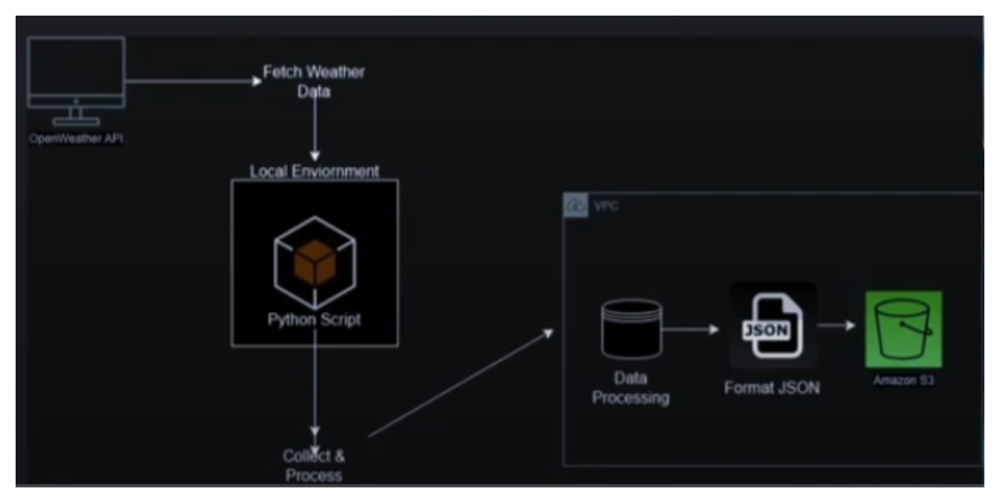
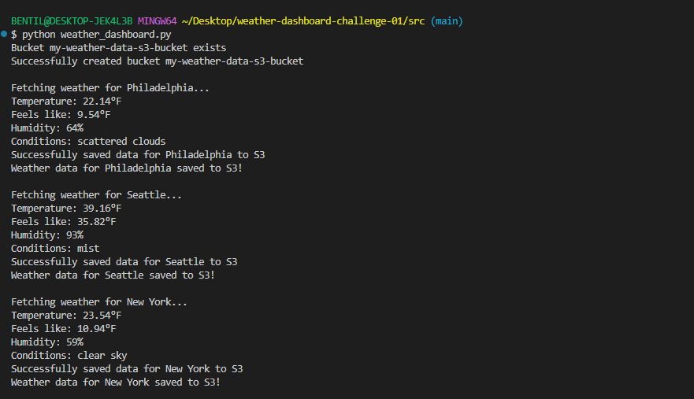
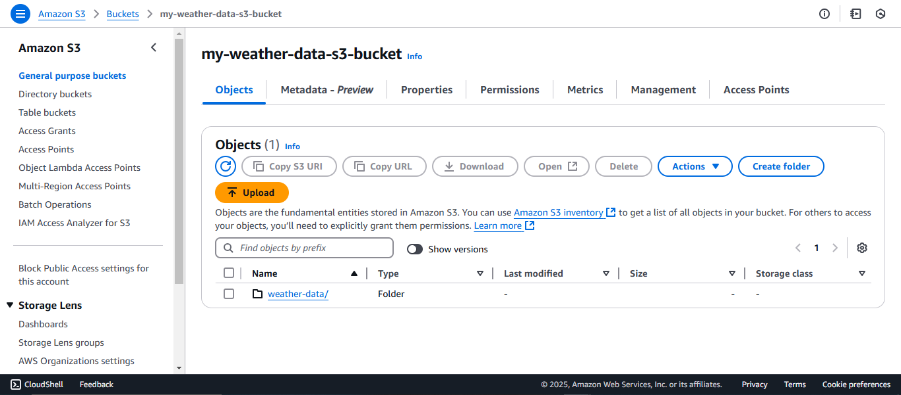
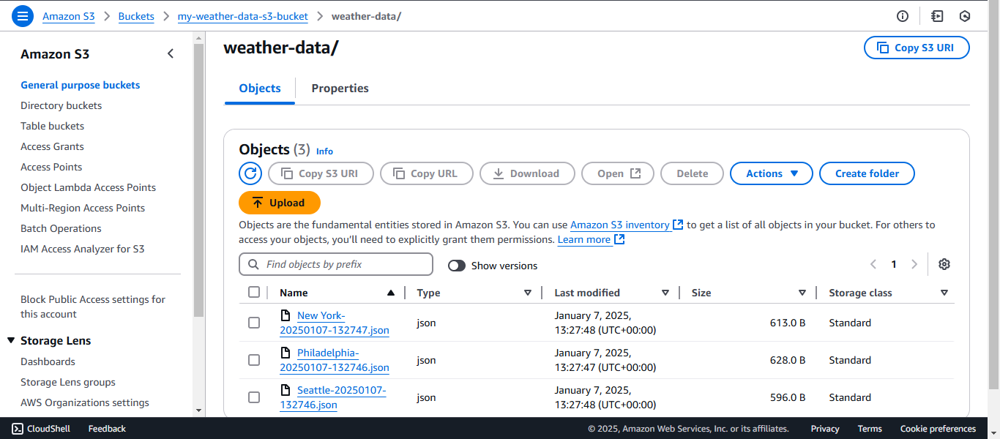

# Weather Dashboard - 30 Days DevOps Challenge

Day 1 - Creating a Weather Dashboard using AWS S3 buckets and OpenWeather API

## Project Overview

The Weather Dashboard project demonstrates core DevOps principles by integrating **cloud computing**, **API development**, and **Python programming**. It fetches real-time weather data, processes it, and securely stores it in **AWS S3**. This project emphasizes modularity, security, and scalability.



## Features

- **Weather Data Retrieval**: Fetches real-time data from the OpenWeather API.
- **Secure Cloud Storage**: Automatically stores weather data in AWS S3.
- **Multi-City Tracking**: Monitors weather data for multiple cities.
- **Timestamping**: Adds historical tracking with precise timestamps.
- **Environment Security**: Uses `.env` files to manage API keys and sensitive credentials.

## Technical Architecture

- **Programming Language**: Python 3.x
- **Cloud Provider**: AWS (S3)
- **API Integration**: OpenWeather API
- **Key Dependencies**:
  - `boto3` - AWS SDK for Python
  - `python-dotenv` - Environment variable management
  - `requests` - HTTP requests handling

## Project Structure

```plaintext
weather-dashboard/
├── src/
│   ├── __init__.py
│   ├── weather_dashboard.py
├── .env
├── .gitignore
├── requirements.txt
```

## Setup Instructions

### Step 1: Clone the Repository

```bash
git clone https://github.com/ShaeInTheCloud/30days-weather-dashboard.git
cd 30days-weather-dashboard
```

### Step 2: Install Dependencies

```bash
pip install -r requirements.txt
```

### Step 3: Configure Environment Variables

Create a `.env` file in the project root and populate it with:

```plaintext
OPENWEATHER_API_KEY=your_openweather_api_key
AWS_BUCKET_NAME=your_aws_bucket_name
AWS_ACCESS_KEY_ID=your_aws_access_key_id
AWS_SECRET_ACCESS_KEY=your_aws_secret_access_key
AWS_REGION=your_aws_region
```

### Step 4: Configure AWS Credentials

Set up AWS CLI credentials:

```bash
aws configure
```

Provide your **Access Key**, **Secret Key**, and **Default Region**.

### Step 5: Run the Application

Execute the script to fetch and store weather data:

```bash
python src/weather_dashboard.py
```

## Example Output

When the script runs, the output includes fetched weather data and success messages:



## Key Functionalities

1. **Fetch Weather Data**
   Retrieves temperature, humidity, and conditions using the OpenWeather API.

2. **Create AWS S3 Bucket**
   Automatically creates the specified S3 bucket if it does not already exist.

3. **Save Data to S3**
   Saves weather data in JSON format, organized by city and timestamp.

## What I Learned

- **AWS Resource Management**: Created and configured S3 buckets.
- **Environment Management**: Utilized `.env` for secure credential handling.
- **Python Development**: Enhanced proficiency in API integration and error handling.
- **Version Control**: Applied Git for iterative development.
- **Cloud Automation**: Integrated and automated cloud resource usage.

## Future Enhancements

1. **Weather Forecasting**: Add prediction capabilities using advanced APIs.
2. **Data Visualization**: Build interactive dashboards for weather trends.
3. **Dynamic City Addition**: Enable user input to track new cities dynamically.
4. **Automated Testing**: Add unit and integration tests for robust performance.
5. **CI/CD Integration**: Implement a pipeline for continuous deployment.

## Troubleshooting

### Common Issues and Fixes

1. **`aws: command not found`**

   - Ensure AWS CLI is installed and added to your PATH.

2. **Missing Dependencies**

   - Run `pip install -r requirements.txt` again to ensure all dependencies are installed.

3. **Permission Errors**

   - Verify your IAM permissions for accessing S3.

4. **API Errors**
   - Double-check your OpenWeather API key and usage limits.

## Verify the Output

To confirm the data has been saved correctly, navigate to your AWS S3 console and check the contents of your bucket. You should see JSON files organized by city and timestamp.




## Clean Up

To avoid unnecessary charges, delete the S3 bucket after verifying the data.

## Acknowledgments

Special thanks to **[DeShae Lyda](https://www.linkedin.com/in/deshae-lyda/)** or **[ShaeInTheCloud](https://www.youtube.com/watch?v=A95XBJFOqjw)** and the other Cloud Engineers involved for the guidance and inspiration to embark on this exciting challenge. Your support and expertise have been instrumental in making this project a reality.

## Conclusion

The Weather Dashboard project demonstrates the power of combining **cloud computing**, **API integration**, and **Python development**. By leveraging **AWS S3** and **OpenWeather API**, this system provides a scalable, secure, and user-friendly solution for tracking weather data.

This project serves as a solid foundation for exploring **DevOps practices**, with room for enhancements like forecasting, data visualization, and CI/CD pipelines. Whether you're a beginner or an experienced developer, this system offers a comprehensive introduction to **cloud-based development**.
