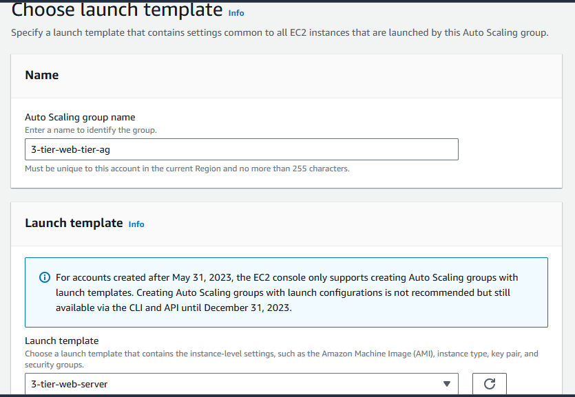
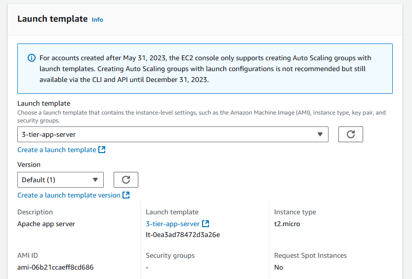

# Building Scalability and Resilience: Transforming Customer Experience with AWS 3-Tier Architecture

## Project Challenge:

You have been tasked with addressing the infrastructure challenges of **ShopEase**, an expanding e-commerce company facing significant limitations with its existing platform. With growing traffic, ShopEase’s current website suffers from slow load times and occasional outages, causing customer frustration and lost sales.

Your project aims to implement a scalable, reliable solution by designing and deploying a **3-tier architecture on AWS**. This approach will separate the presentation, application, and data layers to improve performance, enhance security, and provide a seamless shopping experience for customers.

## Overview:

In this project, I will guide you through the process of manually configuring a scalable and resilient e-commerce platform leveraging a **3-tier architecture** on **Amazon Web Services (AWS)**. This architecture includes the **Web Tier**, **Application Tier**, and **Database Tier**, each serving a specific purpose in the platform.

## Objectives:

- Create a **Comprehensive Architectural Diagram** illustrating the arrangement of the Web Tier, Application Tier, and Database Tier.
- Carefully plan and allocate the **CIDR block** for the VPC and Subnets before their creation.
- Configure both **Public and Private Route Tables** as necessary.
- Set up a **NAT Gateway** within a Public Subnet to allow instances within Private Subnets to access the internet for package updates and patches.
- Employ a **Bastion Host** in the Public Subnet.
- Enable communication between the Web Tier and Application Tier, and **Ping Application Tier from Web Tier**.

## Prerequisites:

- **AWS account** (free-tier)
- Basic knowledge of **AWS console and resources**
- **Secure Shell (SSH)** access to your server
- **GitHub account**

---

## Step 1: Plan VPC and Subnet CIDRs Before Creation

- Navigate to the **VPC dashboard** and select **Create VPC**.


- Under the **Create VPC** tab, create a **Name tag** and enter your **IPv4 CIDR address**.
- Make sure that IPv4 CIDR is set to manual, and enter `10.10.0.0/16`.
- Click on **Create VPC**. The VPC is now successfully created.


## Step 2: Design and Diagram the Architecture

It’s crucial to create a diagram illustrating the structure of your 3-tier architecture. This diagram should clearly show the placement of resources, including **subnets**, **security groups**, **EC2 instances**, and **RDS databases** in their respective tiers.


## Step 3: Set Up Subnets

1. Navigate to the **Subnets** tab under **Virtual Private Cloud**.
2. Select **Subnet** and click **Create Subnet**.


3. Select your **VPC ID** under the VPC tab.


4. Create 2 **Public Subnets** within your chosen **Virtual Private Cloud (VPC)**:
   - Create a **Subnet name**
   - Select the **Availability Zone** for your Subnet
   - Set the **IPv4 CIDR block address** for your Subnet
   - Create a **Tag** with a Key and Value.


5. Instead of clicking **Create Subnet**, click on **Add new subnet** to create additional subnets.


All 6 subnets have been created.


## Step 4: Set Up the Route Tables

1. Navigate to the **Route Tables** tab under **Virtual Private Cloud** and select **Create Route Tables**.

   

2. Create a **Route Table for the web-tier**:

   - Give the route table a unique name for this tier.
   - Select the VPC created for this project for your route table.

   

   - Add a Tag for the route table.

   

3. Repeat the process to create route tables for **app-tier** and **db-tier**.

   

## Step 5: Associate the Route Tables with Subnets

Now that the Route Tables and Subnets have been created, associate them:

1. Select the **web-tier route table**, go to **Subnet associations**, and select **Edit subnet associations**.

   

2. Select the two **web-tier subnets** and associate them with the web-tier route table, then click **Save associations**.

   

3. Next, select the **app-tier route table**, go to **Subnet associations**, and select **Edit subnet associations**. Select the two **app-tier subnets** and save.

   

4. Finally, select the **db-tier route table**, go to **Subnet associations**, and associate the **db-tier subnets**.

   

5. Verify associations under **Explicit subnet associations**.
   

### Step 6: Select the Internet Gateway

1. Go to the **Internet Gateways** tab under **Virtual Private Cloud**.

   - Create the Internet gateway with a unique name, and add a tag with a key and value, just like in the previous steps.

   

2. **Attach the Internet Gateway to the VPC**:

   - Search for the VPC created for this project.
   - Select **Attach Internet Gateway**.

   
   

3. **Add Route Tables to the Internet Gateway**:

   - Navigate back to the **Route Tables** tab under **Virtual Private Cloud**.
   - Select the **public-web-route-table**, then go to the **Routes** tab and choose **Edit Routes**.

   

4. **Add Route for All Traffic**:

   - Add a route to allow all traffic to the destination and target the Internet Gateway.
   - Click **Save Changes**.

   

---

### Step 7: Create NAT Gateway

1. Go to the **NAT Gateways** tab under **Virtual Private Cloud** and select **Create NAT Gateway**.


- Choose the **web-tier-public-subnet** for the NAT Gateway.
- Create a unique name for the NAT gateway.
- Select one of the **web-tier-public-subnets**.
- Leave **Connectivity Type** set to **Public**.
- Choose **Allocate Elastic IP** and create the NAT Gateway.

> **Note**: Elastic IPs allow the NAT gateway to retain the same IP address in case of events like stopping or restarting an instance.


2. **Add Route Tables to the NAT Gateway**:

   - Go back to the **Route Tables** tab under **Virtual Private Cloud**.
   - Select the **private app-tier-route-table**, then go to the **Routes** tab and select **Edit Routes**.

   

   - Add a route to allow traffic and set the **Target** to the NAT Gateway you just created. Save the changes.

   

---

🎉 **Congratulations!** You've successfully provisioned the VPC, Subnets, Route Tables, Internet, and NAT Gateways!

Now, let’s proceed with provisioning the servers.

---

### Step 8: Set Up the Web Tier

1. Go to the **EC2 Dashboard** and select the **Launch Templates** tab.


- Name the Launch Template, add a **Template Version Description**, and create a **Template Tag**.


2. **Select AMI and Instance Type**:

   - Choose the **Amazon Linux AMI** and **t2.micro** instance type from the **Browse more** tab.

   
   

3. **Create or Select a Key Pair**:

   - Use a Key Pair created specifically for this project.

   

4. **Network Settings**:

   - Omit the subnet for this template in this project.
   - Create a new Security Group named **three-tier-web-server-sg** with the following:

     - **Description**: three-tier-web-server-sg
     - Select the VPC created for this project.

     

5. **Configure Inbound Security Group Rules**:

   - Add a rule of type **SSH** with a **Source** of `0.0.0.0/0`.
   - Add a rule of type **HTTP** with a **Source** of `0.0.0.0/0`.

   

6. Go to the **Advanced Details** tab and add your launch script in the **User Data** field.


**Configure User Data**

In this step, add a launch script to automate the installation and setup of a simple web server. In the **Advanced Details** section, locate the **User Data** field and paste the following script:


```bash
#!/bin/bash

# Update the instance

yum update -y

# Install Apache

yum install -y httpd

# Start Apache and enable it to start on boot

systemctl start httpd
systemctl enable httpd

# Create a simple HTML file

echo "<!DOCTYPE html>

<html lang='en'>
<head>
    <meta charset='UTF-8'>
    <meta name='viewport' content='width=device-width, initial-scale=1.0'>
    <title>Welcome</title>
    <style>
        body { font-family: Arial, sans-serif; text-align: center; background-color: #f4f4f9; margin-top: 50px; }
        h1 { color: #333; font-size: 2.5rem; }
    </style>
</head>
<body>
    <h1>Welcome to the ShopEase Platform!</h1>
</body>
</html>" > /var/www/html/index.html

```

7. Review the summary, then select **Create Launch Template**.


---

### Create an Auto Scaling Group

1. In **Actions**, select **Create Auto Scaling Group** after choosing the template.


2. Name your Auto Scaling Group and select the Launch Template you just created.



3. Choose the VPC and the two public web tier subnets.


4. Set the **Desired Capacity** to 2, with a minimum of 2 instances and a maximum of 2 instances.


5. Keep the remaining settings as default, then review and create the Auto Scaling Group.


---

### Verify Accessibility

After the Auto Scaling Group updates to the desired state, verify that your web servers are accessible by selecting the **Public IPv4 Address** of an instance. Open the address in a new browser tab to confirm.


---

🌟 **Great Work! Give yourself a pat on the back!**

## Step 9: Set Up the Application Tier

1. **Navigate to the EC2 Dashboard**:

   - Open the **Launch Templates** tab.
   - **Name the Launch Template**, add a **Template version description**, and create a **Template tag**.

   

2. **Select AMI and Instance Type**:

   - Click on **Browse more** to select an AMI.
   - For this setup, use **Amazon Linux AMI** with the **t2.micro** instance type.

   

3. **Key Pair Selection**:

   - Choose the same key pair used for the web tier instance.

   

4. **Network Settings**:

   - Omit the Subnet for this template.
   - Select **Create security group**.
   - Set the security group name as `three-tier-app-sg`.
   - Enter **Apache app sg** as the description.
   - Choose the VPC created for this project.

   

5. **Inbound Security Group Rules**:

   - Select **Add security group rule**.
   - For **Type**, choose **SSH**.
   - Set the **Source** to the **3-tier-web-server-sg** security group.
   - _Note_: The application tier should only be accessible from the web tier.

   

6. **Create Launch Template**:

   - Review the template summary and select **Create launch template**.

   

7. **Auto Scaling Group Setup**:

   - Go to the **EC2 Auto Scaling** dashboard.
   - Select **Create Auto Scaling Group** and enter a name for the group.

   

   - Choose the launch template created earlier and click **Next**.

   

8. **VPC and Availability Zones**:

   - Select the appropriate VPC and availability zones for the app tier, then proceed to the next step.

   

9. **Group Size Desired State**:

   - Set the desired capacity with a **minimum of 2 instances** and a **maximum of 2 instances**.

   
   

   - Skip the advanced options, review the configuration, and create the auto scaling group.

   

10. **Verify Instance Status**:

- Confirm that two instances are running in the web tier and two in the app tier.


- _Optional_: Label each instance to clearly indicate its tier and subnet.


11. **Ping the App Tier from the Web Tier**:

- SSH into `web-tier-public-subnet-1` to test connectivity.
- Select the corresponding instance and click **Connect**.
- Use the **SSH client** tab instructions for your preferred terminal app.
- _Set permissions on the key file_:
  ```bash
  chmod 400 yourkeypair.pem
  ```
- Copy the SSH connection example provided on the AWS console and paste it into your terminal.
- After connecting to the instance, ping the private IP address of the app tier’s subnet:

  ```bash
  ping <app-tier-private-IP>
  ```

  

  

- Press **Ctrl + C** to stop the ping.

12. **SSH into the App Tier**:

- **Transfer the private key** to your web tier instance (for security reasons, detailed steps for this are omitted).
- Run the following to ensure proper permissions on the key:
  ```bash
  chmod 400 yourkeypair.pem
  ```
- SSH from the web tier to the app tier using the private IP of the app tier instance.


13. **Install MySQL on the App Tier**:

```bash
sudo yum update -y
sudo yum install mysql -y
```

14. **Update Environment and Install MySQL**

Before proceeding to set up the Database Tier, ensure your application environment is updated and MySQL is installed.

1. **Update your environment**:

```bash
sudo yum update -y
```


2. **Install MySQL**:

```bash
sudo yum install mysql -y

```


## Step 10: Set Up the Database Tier

### 1. Navigate to the RDS Dashboard

- Go to the **RDS Database** dashboard in the AWS Management Console.
- Select **Create database** to start configuring the database.


### 2. Database Creation Method

- Choose the **Standard create** method.
  

- Select **MySQL** as the database engine.
  

### 3. Free Tier Selection

- Choose the **Free tier** template to stay within the free tier limits (or select a different option if required).


### 4. Database Details

- Enter a unique **DB instance identifier**, such as `database-tier`.
- Create an **8-digit password** for the database administrator account.


### 5. Connectivity Configuration

- Select the **VPC** created for this project to host the database.
  
- **DB Subnet Group**:
  - Create a DB subnet group to define where your RDS instances will be deployed.
    
- **Security Group**:
  - Create a new security group named `three-tier-db-sg` to control access to the database.
    
- **Review Configuration**:
  - Review the configuration then click **Create Database**.
    

### 6. Subnet Group Configuration

- Go to the **Subnet groups** tab on the RDS dashboard.
  
- Create a new **DB subnet group** by providing:
  - A **name** for the group.
  - A **description**.
  - Select the VPC configured for this project.
    
- Choose appropriate **Availability Zones** and **Subnets** for redundancy and availability in the database tier.
  
  

### 7. Inbound Security Group Rules for DB

- Go to the **three-tier-db-sg** security group settings.
- Add an inbound rule to allow **MySQL** traffic (TCP on port 3306).
- Set the **Source** to be the **app tier’s security group** (`three-tier-app-sg`), enabling access only from the application tier.
  

### 8. Connect to the MySQL Database

- After the RDS instance is ready, retrieve the endpoint from the **Connectivity & security** tab in the RDS dashboard.
- Use the following command to connect to the MySQL database:

  ```bash
  mysql -h <endpoint> -P 3306 -u admin -p
  ```

- Replace `<endpoint>` with the actual endpoint of your RDS instance.

  

**Success!!!** You have successfully set up and connected to your MySQL database in the database tier.

## Conclusion

In this project, we addressed the infrastructure challenges facing **ShopEase** by designing a robust **3-tier architecture on AWS**. By separating the **presentation**, **application**, and **data layers**, this solution significantly improves the scalability, reliability, and security of ShopEase’s platform.

This architecture mitigates the issues of slow load times and outages, ensuring a seamless and responsive experience for customers, even during peak traffic. With this scalable AWS solution, ShopEase is well-positioned to handle future growth, minimizing disruptions and maximizing customer satisfaction.

Thank you for exploring this solution. Here’s to a faster, more reliable ShopEase experience!

```

```
